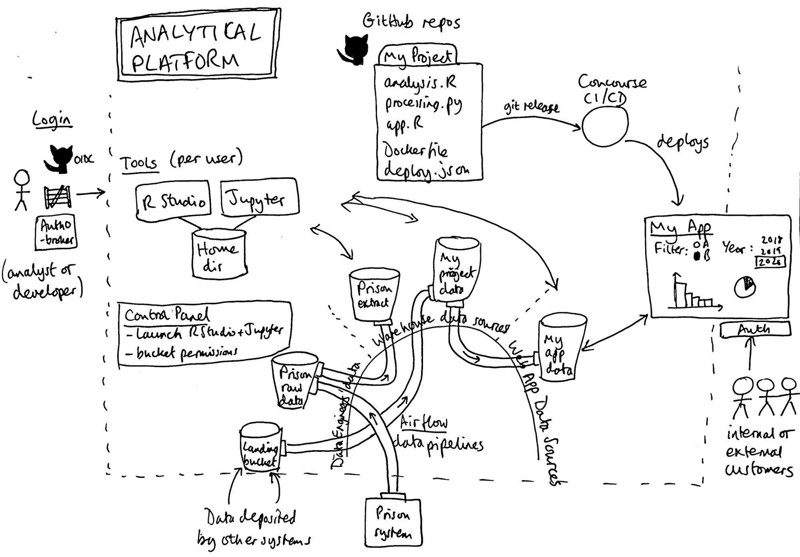

# Architecture

This document describes the technical architecture of the Analytical Platform with diagrams and descriptions.

See also: [Index of Analytical Platform documentation](https://github.com/ministryofjustice/analytics-platform)

## Diagrams

### Architecture diagram

This diagram shows the main parts of the Analytical Platform, all described further down this document:

* "Tools" - RStudio and Jupyter
* Code on GitHub
* Data Sources - 'data lake' buckets and pipelines
* Control Panel
* Apps

### AWS view

[PDF version](images/Analytical_Platform_AWS_view.pdf)

This diagram shows the main AWS resources. In particular we see the Kubernetes cluster is split over 3 Availability Zones, so that in the event of one failing, the k8s cluster can continue to operate on the remaining 2 AZs (albeit with them auto-scaling the workers up, and suffering a temporary loss of non-replicated instances - R Studio and Jupyter.)

### Kubernetes view

[PDF version](images/Analytical_Platform_Kubernetes_view.pdf)

This diagram shows the Kubernetes resources - the pods for the tools (RStudio) and support services - Tiller, Grafana, Prometheus etc.
Also we can see that access to most of these pods is via GitHub OIDC via Auth0. The tools  (RStudio, Jupyter) and Apps have the Auth Proxy which is the OAuth2 client, whereas Concourse, Grafana, Prometheus and Kibana have their own OAuth2 client implementation.

The diagram is a little out of date:

* We don’t use Google Apps OIDC any more
* It should show deployed apps.
* Concourse now replaces Jenkins for deploying apps.

## Overall description

The Analytical Platform (AP) is an environment for data work - performing data analysis and delivering data-focused web apps. It is used by approximately 300 analysts and data scientists in the Ministry of Justice. It has been assembled mainly from open source components. It is designed with best practice cloud security for working with OFFICIAL level data, which is what makes up the vast majority of MoJ's work.

There is a more complete top-level description of the product and technical features in the [User Guidance: About the Analytical Platform](https://user-guidance.services.alpha.mojanalytics.xyz/about.html#content)

## "Tools" - RStudio and Jupyter

AP's primary feature is providing users with development environments. AP gives users a running copy of RStudio and Jupyter, so they can write analytical code in R or Python.

These tools, like most of AP, run as containers, managed by Kubernetes, and all hosted on Amazon Web Services. Users access RStudio and Jupyter through their browser, so it does not require them to install any additional software on their machine. The browser acts as a relatively thin client - the data is held and processed server-side - in AP's cloud environment.

A user is provided with a dedicated container for each of RStudio and Jupyter, and these have a home directory mounted, which is from a networked disk (using NFS protocol, served by SoftNAS and backed by EBS volumes). So a user can run their RStudio and Jupyter side-by-side and they both show the same files.

However a user cannot share their home directory files with other users (without resorting to e.g. downloading them to their local machine first). It is by design that their home directory is considered a temporary place for day-to-day use. Users are encouraged to store their files elsewhere for sharing and long-term storage:

* Code is stored on GitHub
* Data is stored in S3 buckets

## Code on GitHub

Users store their code on GitHub - in repos within the [moj-analytical-services organization](https://github.com/moj-analytical-services/).

Whilst using git is normal for developers, it is relatively new to many analysts, but offers a number of benefits:

* The history allows developers to track changes and roll back if needed

* The history offers auditability - who introduced a change, when and why

* The history is essential for reproducibility - you can reproduce a result if you can get the code and data as it was on a certain date, if the result is challenged, which is important when you're advising ministers etc and need to be publicly accountable

In addition we are encouraging [GitHub Flow](https://guides.github.com/introduction/flow/), whose practice of peer review using Pull Requests is as important for statistical analysis and modelling, as it is for traditional software engineering.

Users set-up their git access manually by [creating an ssh key on their home drive and configuring their GitHub account to recognize it](https://user-guidance.services.alpha.mojanalytics.xyz/introduction.html#configure-git-and-github).

Permissions-wise, those repos are mostly set to 'internal', so that all AP users can read each others' code, but only those on the project have write permission. However some repos are 'public', as there is an aim to work open and transparently. In those cases we have to be extra sure there are no credentials or data in that code, and we do this only when those working on it are considered mature enough in work practices to be trusted to be reliable at this.

## Data Sources

In the Analytical Platform, user data is stored in S3 buckets. The buckets have the IAM permissions adjusted (in Control Panel) to allow access to appropriate users and apps. There are a few different categories of buckets:

* Warehouse data sources - these buckets are created by users or curated by Data Engineers. They can be accessed by users in their tools, but not apps.

* App data sources - these are like Warehouse data sources, but they can also be accessed by apps. An app should have access to only the data it needs, so it's useful to clearly label buckets designed for apps, compared to those designed for more exploratory use in tools.

* Data engineering buckets - these buckets are not visible in the Control Panel. The Data Engineers (DEs) use these buckets to receive data from data sources that are external to the Analytical Platform, and for intermediate processing. Data pipelines - movements and transformations - are generally done in AP's instance of Apache Airflow. Once DEs have got data ready for use by regular Analytical Platform users, it is dropped into a Warehouse data source (bucket) and/or exposed as an Amazon Athena 'database'.

* (There are also a few buckets used internally by AP, e.g. for Terraform state and backups. These are the only ones without an `alpha-` or `dev-` prefix.)

## Control Panel

[Control Panel](https://github.com/ministryofjustice/analytics-platform-control-panel) (CP) is a Django app that is the 'Home Page' for users of the Analytical Platform. It offers them management of two key things:

1. Tools - including RStudio and Jupyter.

    CP provides the user with buttons to 'start', 'stop', 'restart' and 'upgrade' their tool containers. This control over the lifecycle is helpful to users because they do not always run smoothly. And they need some control over the version of RStudio and other things in the images.

    These controls are a thin wrapper over Helm deploy commands, and k8s API to get the current pod state. These are run as the user's k8s user and deploy to the user's k8s namespace.

2. Data sources - i.e. S3 buckets

    S3 buckets can be created, files uploaded, and permissions changed. Permissions for users include: admin/write/read, and determines what a user can do in a tool (RStudio & Jupyter). Buckets that can be managed are 'Warehouse data sources' and 'App data sources' - only the latter can have read/write access given to one or more apps.

    These controls are a thin wrapper over IAM config.

    In addition, the CP provides a link to the AWS Console, where the user is temporarily logged in as their AWS Role. This gives the user a UI to manage the files in their buckets - including the ability to upload data files from their computer.

## Apps

Apps are a popular way for users to communicate their analysis - e.g. with tables, charts, and include interactivity such as filters and search boxes. Analytical Platform supports these apps by providing:

* a CI/CD pipeline - users that create a GitHub repo that is an app (have a 'deploy.json' file) will be automatically provided with a corresponding Concourse CI/CD pipeline. So when the user creates a release on GitHub, the app is deployed. Users can adjust settings in a `deploy.json` file in their repo, e.g. to configure auth.

* Hosting - each app runs with 3 replicas on the k8s cluster

* Auth - access to the app is protected by auth-proxy. Depending on configuration in deploy.json, it will ask the user to login, or be locked to access from a certain IP range.
